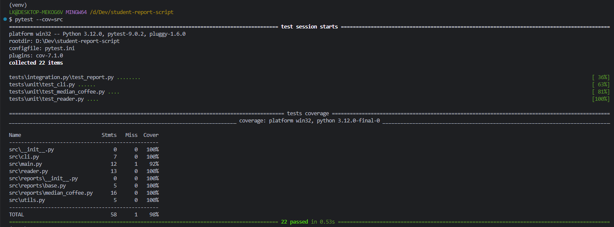
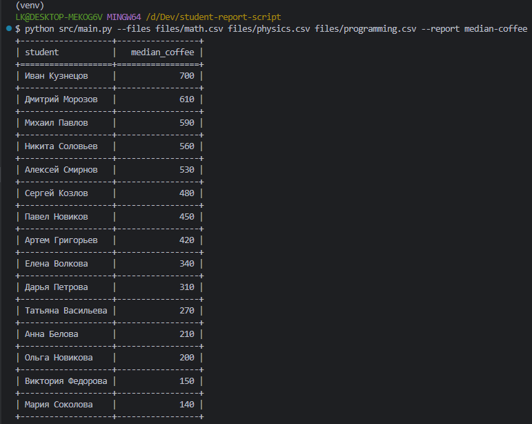

# Coffee Spent Report Script

**Козлов Леонид**
[GitHub](https://github.com/KozlovL)

---

## Описание

Скрипт для обработки CSV-файлов с данными о студентах и формирования отчёта по медиане трат на кофе (`median-coffee`).
Отчёт строится по всем переданным файлам и выводится в консоль в виде таблицы.

---

## Клонирование и запуск

```bash
git clone https://github.com/KozlovL/student-report-script
cd student-report-script
```

### Виртуальное окружение

Создание и активация:

```bash
python -m venv venv
```

Windows:

```bash
venv\Scripts\activate
```

Linux / macOS:

```bash
source venv/bin/activate
```

Установка зависимостей:

```bash
pip install -r requirements.txt
```

### Установка PYTHONPATH

Linux / macOS:

```bash
export PYTHONPATH=$(pwd)
```

Windows (PowerShell):

```powershell
$env:PYTHONPATH = (Get-Location)
```

---

### Запуск скрипта

```bash
python src/main.py --files files/math.csv files/physics.csv files/programming.csv --report median-coffee
```

---

## Тестирование

Запуск тестов:

```bash
pytest
```

Проверка покрытия:

```bash
pytest --cov=src
```



---

## Добавление нового отчёта

Архитектура проекта позволяет легко добавлять новые отчёты.

1. Создать новый файл в `src/reports/`, например:

```python
# src/reports/new_report.py

from reports.base import BaseReport

class NewReport(BaseReport):
    def build(self, data):
        ...
```

2. Зарегистрировать отчёт в `REPORTS`:

```python
# src/utils.py

from reports.new_report import NewReport

REPORTS = {
    'median-coffee': MedianCoffeeReport,
    'new-report': NewReport,
}
```

3. После этого отчёт станет доступен через CLI:

```bash
--report new-report
```

---

## Структура проекта

```
src/
├── main.py          # точка входа
├── cli.py           # парсинг аргументов
├── reader.py        # чтение CSV
├── utils.py         # выбор отчёта
└── reports/         # реализация отчётов
```

---

## Особенности

* Используется только стандартная библиотека (argparse, csv, statistics)
* Расширяемая архитектура отчётов
* Покрытие тестами (pytest)
* Проверка качества кода (ruff, mypy)

---

## Пример вывода

